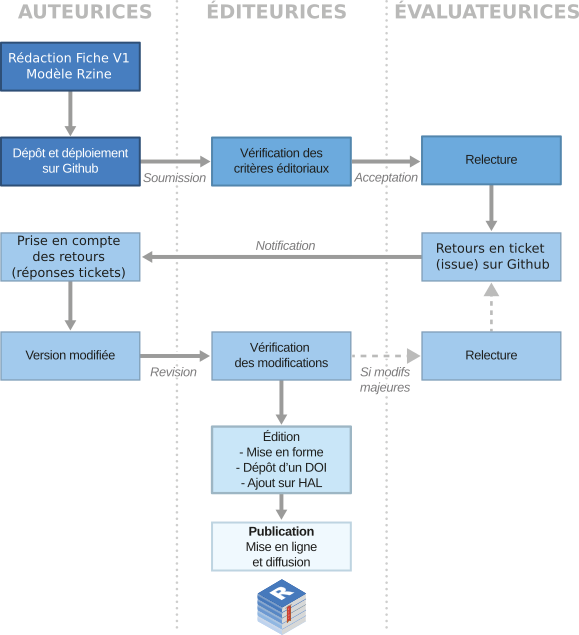

# Soumettre un article Rzine  

**Comité éditorial Rzine**

---

Ce dépôt présente les fichiers de référence attendus pour la soumission d'un article Rzine et les consignes éditoriales. Vous y trouverez notamment le modèle template.qmd dont vous pouvez vous servir de référence pour initier votre contribution. 

## Fichiers et dossiers obligatoires attendus

- index.qmd : document Quarto contenant votre contribution. Il est impératif que ce fichier soit nommé **index.qmd**. 
- index.html : votre contribution déployée au format .html
- un dossier **data** qui contient les données que vous mobilisez.
- un dossier **fig** qui contient les éventuelles figures que vous intégrez à l'article. 
- un fichier **bibliogaphy.bib** qui contient les références bibliographiques. 

Pour suivre la fiche de style rzine, il est nécessaire d'inclure à votre soumission le dossier **_extensions**, dont vous n'avez pas à modifier le contenu. 

## Processus de soumission 

1. **Consultez attentivement les consignes éditoriales** pour être sûr.e de ne pas travailler pour rien :-)
3. **Téléchargez l'archive de ce dépôt exemple** et décompressez la.
3. A vous de jouer pour adapter ces fichiers modèle à votre contribution ! 
4. Déposez votre travail sur un **dépôt GitHub**. Pour les néophytes, la démarche à suivre est détaillée ci-dessous. 
5. **Contactez le comité de lecture Rzine** pour soumettre votre fiche à l'évaluation. Pour cela envoyez un courriel à **contact@rzine.fr** en précisant l'adresse du dépôt qui héberge votre article. Vous serez contacté dans les 15 jours suivant de courriel. 
6. **Relecture**. Si votre soumission est validée, un relecteur·rice doté·e des connaissances techniques et thématiques nécessaires sera proposé·e à l’auteur·e dans les 15 jours (vous pouvez aussi proposer des noms=. Rzine est dans une démarche volontariste d’Open Science. La relecture des fiches Rzine est ouverte et transparente. L’identité du ou des relecteur·rice·s et l’ensemble de leurs retours sont publics. Parce qu’une fiche est un document computationnel, l’ensemble du processus se déroule sur GitHub. Vous serez donc invité·e à ouvrir les droits du dépôt GitHub de votre fiche au relecteur·rice désigné·e. Les retours et les demandes d’améliorations se feront directement sur la plateforme GitHub via des issues et des pull-request.
7. **Publication**. Une fois les demandes d’améliorations prises en compte et la publication validée par l’évaluateur·rice, une fiche de métadonnées associée à la publication vous sera demandée afin d’assurer son référencement sur Rzine.fr. Votre dépôt est ensuite cloné dans le dépôt GitLab Rzine, et la publication déployée depuis celui-ci. Un DOI sera associé à la publication, qui sera également référencée sur HAL et sur Rzine.fr.

Ce schéma résume le processus de relecture dans son ensemble :

## Initier votre article avec GitHub

Le logiciel de gestion de versions décentralisé à utiliser pour la soumission est le plus connu et le plus utilisé dans le monde : [GitHub](https://fr.wikipedia.org/wiki/GitHub). 

### Création de compte

Connectez-vous à la [page de création de compte GitHub](https://github.com/)) et saisissez les informations attendues.

  

### Création d'un dépôt

Cliquez sur “Start a project” ou “Create repository” pour créer un dépôt qui hébergera votre fiche.

  

Vous pouvez également créer un nouveau dépôt en cliquant sur “+” puis “New repository” en haut à droite de la fenêtre :

  

Un fois sur la page de création d’un nouveau dépôt, saisissez un nom de dépôt (sans espaces ni caractères spéciaux) et éventuellement une description. Initialisez ce dépôt comme Public et demandez l’ajout automatique d’un fichier README.md, puis cliquez sur "Create repository".

  

 Votre dépôt, uniquement rempli d’un fichier README.md, a été créé.
 

  

### Mettre à jour le dépôt

Vous pouvez désormais y ajouter le répertoire contenant tous les fichiers (et sous-répertoires) de votre Fiche.

Il existe plusieurs méthodes pour téléverser des fichiers sur GitHub (en ligne de commande ou en clic-bouton). Nous présentons ici la méthode clic-bouton depuis l’interface de GitHub. Pour le réaliser dans l'environnement RStudio, voir [cette documentation](https://sigr2021.github.io/git/#1), ou [celle-ci](https://docs.github.com/en/get-started/using-git/about-git) si vous souhaitez effectuer ces opérations directement dans le terminal.

Pour cela, cliquez sur “Add file”, puis sur “Upload files”.

  

 

Faîtes glisser l’ensemble des fichiers et sous-répertoires de votre fiche dans le dépôt.

  

 

Chaque mise à jour doit être associée à un [commentaire](https://www.conventionalcommits.org/en/v1.0.0/) permettant de traiter la nature de la modification réalisée. Ajoutez un commentaire et cliquez sur “Commit changes”.

  

 

L’ensemble des fichiers sont désormais stockés sur le dépôt. Ce dépôt étant paramétré comme Public, tout le monde peut désormais consulter et récupérer ces fichiers.

  

 

### Déploiement de l'article

Les fichiers sont consultables à l’état brut, mais une manipulation supplémentaire va permettre de mettre en ligne votre fiche (format HTML). Votre fiche mise en page sera ainsi consultable par tout le monde sur le web, sans avoir à gérer un serveur ou un site web. 

Concrètement, cette opération crée un *workflow* via [GitHub Actions](https://docs.github.com/fr/actions) qui forme un *pipeline CI/CD*, soit une série de tâches automatisées qui aident les équipes DevOps à réduire les tâches manuelles :

- **Continuous Integration** (intégration continue, CI) : crée, teste et intègre automatiquement les modifications de code dans un référentiel partagé. 
- **Continous delivery & deployment** (livraison et déploiement continu, CD) : transmet les modifications de code aux enironnements prêts pour la production et déploie les modifications de code directement sur un serveur. 

Ces opérations sont rendues possibles aisément avec les GitHub Pages. Cliquez sur “Settings > Pages > Source (none)” et sélectionnez la branche “. **Pour que cela fonctionne, le fichier html à déployer (et le rmd pour plus de cohérence) doivent impérativement avoir été renommés “index”**. 

  

 

Ne modifiez pas le répertoire ciblé par défaut (“root”) qui indique la racine du dépôt. Cliquez sur “save”.

  

 

Votre fiche est désormais consultable en ligne depuis votre compte GitHub. La page html est alors distribuée à l’adresse `https://username.gitub.io/repository_name/`. Vous pouvez retrouver cette URL dans le menu “Settings > Pages”.

  

 

Cliquez sur le lien affiché pour consulter la fiche mise en ligne :

 

 

### Readme.md

Le fichier markdown “README” est utilisé pour présenter les informations importantes à propos du dépôt. Son contenu est automatiquement affiché (et mise en forme grâce à la syntaxe markdown) en dessous des fichiers listés du dépôt.

Vous pouvez éditer et modifier facilement ce fichier depuis l’interface GitHub en cliquant sur le symbole crayon.

 
</pr> 

Vous pouvez alors personnalisez le fichier en modifiant : le titre, le sous-titre, le.s auteur.e.s (et affiliation.s), ainsi que l’URL de consultation de la fiche. Par exemple : 

 

 

Une fois les modifications terminées, commentez votre commit, puis cliquez sur Commit changes pour enregistrer les changements effectués.

  

 

Vous avez terminé la mise en ligne de votre article. Désormais, un lien vers votre article déployé est affiché à la racine du dépôt.

  

 

Il ne vous reste plus qu’à contacter le comité de lecture Rzine pour soumettre votre fiche à évaluation. Pour toute question relative au processus de soumission et de relecture d’une fiche, vous pouvez contacter le comité éditorial en envoyant un courriel à l’adresse contact@rzine.fr

